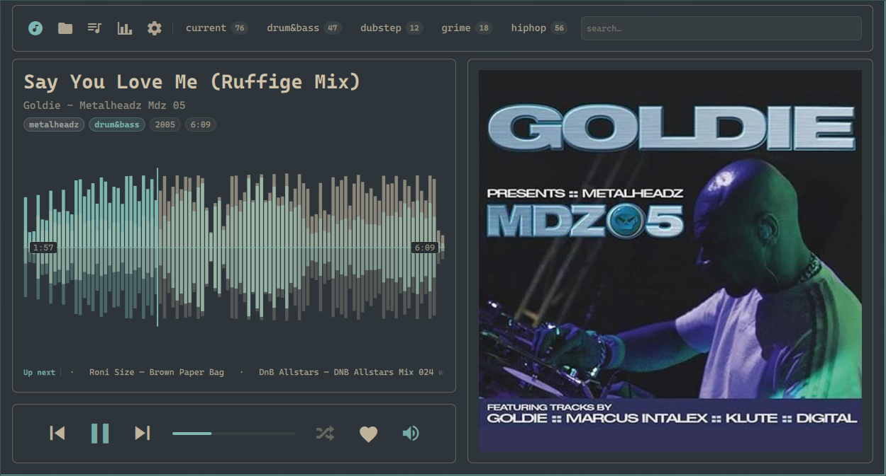

# Evoplayer

Music library and playback for Omarchy shell.

[](docs/screenshots/player.png)

## Layout

```
cmd/evoplayer/     Go daemon + CLI (playback, library, config, history, tags)
qml/panel/         dashboard + monitor service QML
omarchy-plugin/    Omarchy manifest, bar widget, install symlink target
tests/
scripts/           install + link into omarchy-shell
```

## Install (Omarchy)

```bash
bash scripts/install
omarchy-shell shell rescanPlugins
```

Defaults:
- Plugin → `~/.config/omarchy/plugins/seb.evoplayer`
- QML → `qml/panel/` (via plugin `panel/` symlink)
- Runtime → `~/.local/bin/evoplayer` (symlink to `~/.local/lib/evoplayer/evoplayer`)

Open the player:

```bash
omarchy-shell shell toggle seb.evoplayer '{}'
```

See [AGENTS.md](AGENTS.md) for menu entry, autostart, state paths, and IPC tracing.

## Library folders

The music library is a tree of folders, not a genre taxonomy. Top-level dirs under the music root (`misc`, `drum&bass`, `house`, …) are where tracks are filed.

A genre tag is only a hint for which of those folders to use. Untagged downloads stay in `.incoming` until you pick a folder; import then moves the file into that folder (`youtube/` or `mixes/` plus year for long mixes).

## Dev

```bash
bash tests/test-omarchy-plugin
bash tests/test-evoplayer-cli
bash tests/test-evoplayer-qml-smoke
omarchy restart shell
```

See [CONTRIB.md](CONTRIB.md) for commit message and branching conventions.
